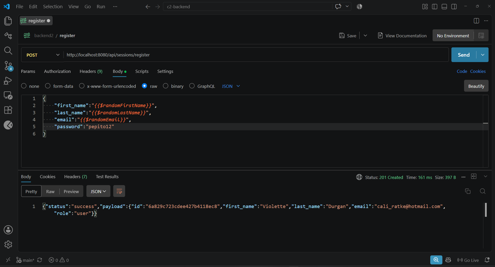
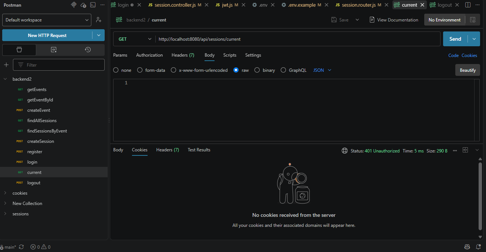
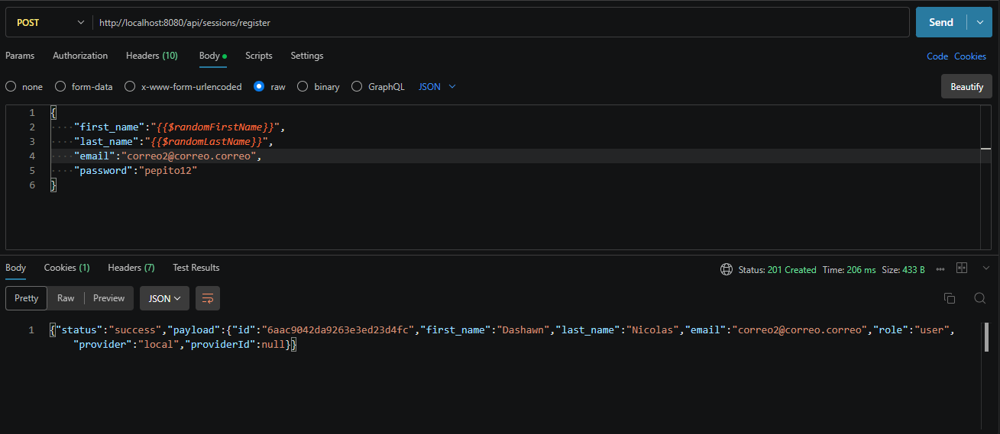
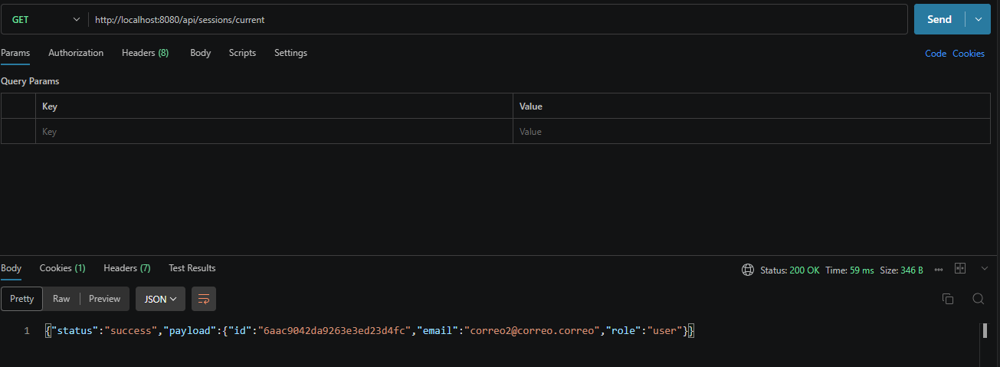
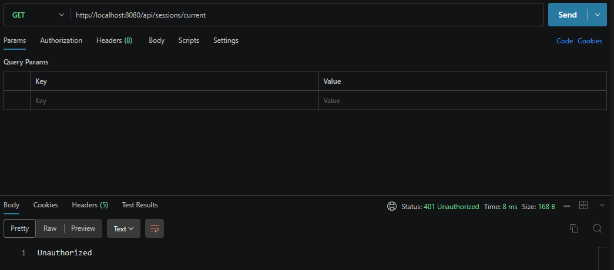
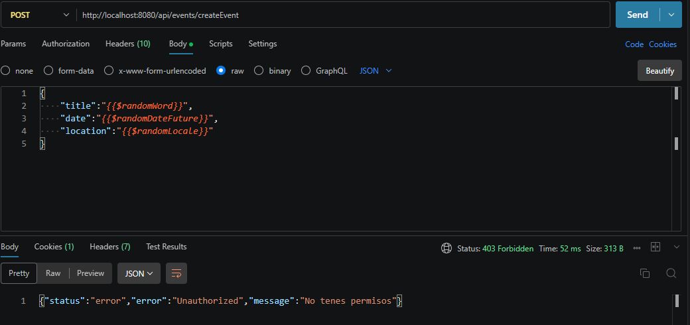
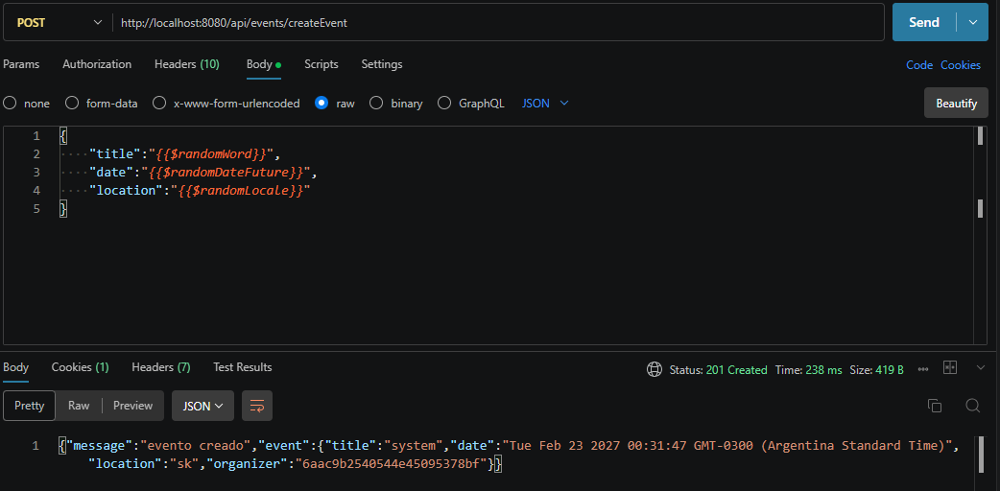
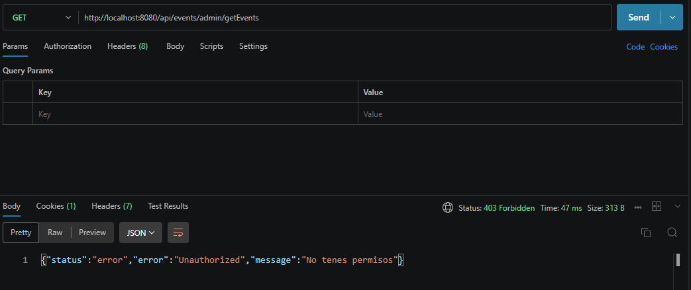
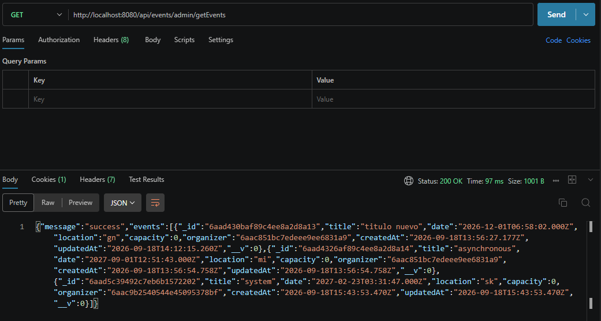

# Backend2
Repositorio de entregas para la materia Programacion Backend II: Diseño y Arquitectura Backend por Lorenzo Suarez Almeyra, temática de eventos y sesiones 

## Base de datos

- Estare utilizando MongoDB

## Tecnologías
- Node.js
- Express
- Nodemon
- dotenv
- mongoose
- cookie-parser
- jsonwebtoken
- passport
- passport-github2
- passport-jwt
- passport-local
- nodemailer
## Instalación
```bash
npm install
```

## Iniciacion
```bash
npm run dev
```

## Rutas disponibles

### Health check

- `GET /api/health`

### Eventos

- `GET /api/events`
- `GET /api/events/:id`
- `POST /api/events/createEvent`
- `PUT /api/events/updateEvent/:id`
- `PATCH /api/events/:id/status`
- `GET /api/events/admin/getEvents`

#### Filtros, paginación y ordenamiento

El listado `GET /api/events` es público y acepta los siguientes parámetros de consulta:

| Parámetro | Descripción | Ejemplo |
| --- | --- | --- |
| `status` | Filtra por estado: `draft`, `published`, `cancelled` o `finished` | `status=published` |
| `category` | Filtra por categoría, sin distinguir mayúsculas y minúsculas | `category=musica` |
| `location` | Filtra por ubicación, sin distinguir mayúsculas y minúsculas | `location=Buenos Aires` |
| `dateFrom` | Fecha mínima del evento | `dateFrom=2026-10-01` |
| `dateTo` | Fecha máxima del evento | `dateTo=2026-12-31` |
| `page` | Número de página, comenzando en `1` | `page=1` |
| `limit` | Cantidad de resultados por página, máximo `100` | `limit=10` |
| `sort` | Ordena por `date`, `price`, `title`, `category` o `location`; anteponer `-` invierte el orden | `sort=-date` |

Ejemplo de consulta combinada:

```text
GET /api/events?status=published&category=musica&dateFrom=2026-10-01&dateTo=2026-12-31&page=1&limit=10&sort=-date
```

La respuesta incluye los eventos y los datos de paginación:

```json
{
    "message": "success",
    "data": [],
    "page": 1,
    "limit": 10,
    "total": 0,
    "totalPages": 0
}
```

#### Roles y acceso a eventos

| Ruta | user | organizer | admin |
| --- | --- | --- | --- |
| `GET /api/events` | Público | Público | Público |
| `GET /api/events/:id` | Público | Público | Público |
| `POST /api/events/createEvent` | No permitido | Permitido | Permitido |
| `PUT /api/events/updateEvent/:id` | No permitido | Solo sus eventos | Cualquier evento |
| `PATCH /api/events/:id/status` | No permitido | Solo sus eventos | Cualquier evento |
| `GET /api/events/admin/getEvents` | No permitido | No permitido | Permitido |

Las rutas protegidas requieren la cookie `currentUser` con un JWT válido.

#### Reglas de negocio

- Los eventos tienen como campos obligatorios `title`, `description`, `category`, `date`, `location`, `capacity`, `price` y `organizer`.
- `organizer` es una referencia a un usuario y se asigna automáticamente desde el usuario autenticado al crear el evento; no se toma del body.
- `status` solo puede ser `draft`, `published`, `cancelled` o `finished`.
- `capacity` debe ser mayor que `0` y `price` no puede ser negativo.
- `title`, `description`, `category` y `location` son obligatorios.
- No se pueden crear eventos con fecha pasada.
- No se pueden modificar eventos cancelados.
- Un organizador solo puede modificar o cambiar el estado de sus propios eventos.
- Un administrador puede modificar o cambiar el estado de cualquier evento.
- Cancelar un evento cambia su estado a `cancelled`; no se elimina físicamente.
- No se puede publicar un evento finalizado o cancelado.
- Si el evento solicitado no existe, la API responde con HTTP `404`.

### Autorización por roles

El registro público siempre crea usuarios con el rol `user`. El rol enviado en el body se ignora para evitar que un usuario se asigne permisos de `organizer` o `admin`.

Las rutas protegidas requieren una cookie `currentUser` con un JWT válido. Si no existe una sesión válida, la API responde `401 Unauthorized`:

```json
{
    "status": "error",
    "error": "Unauthenticated",
    "message": "No autenticado"
}
```

Si el usuario está autenticado pero su rol no tiene permiso para acceder al recurso, la API responde `403 Forbidden`:

```json
{
    "status": "error",
    "error": "Unauthorized",
    "message": "No tenes permisos"
}
```

### Sesiones

- `GET /api/sessions`
- `GET /api/sessions/eventId/:eventId`
- `POST /api/sessions/createSession`
- `POST /api/sessions/register`
- `POST /api/sessions/login`
- `POST /api/sessions/logout`
- `GET /api/sessions/current`
- `GET /api/sessions/github/callback`

### Tickets e inscripciones

#### Rutas

- `POST /api/events/:eventId/tickets` - Crea una inscripción. Requiere autenticación.
- `GET /api/tickets/my-tickets` - Devuelve los tickets del usuario autenticado. Requiere autenticación.
- `GET /api/events/:eventId/tickets` - Devuelve los tickets de un evento. Requiere ser `organizer` del evento o `admin`.
- `PATCH /api/tickets/:ticketId/cancel` - Cancela un ticket. Requiere ser el dueño del ticket o `admin`.

Las rutas protegidas utilizan la cookie `currentUser` con un JWT válido.

#### Modelo Ticket

El modelo contiene referencias a `user` y `event`, sin objetos embebidos, y los siguientes campos:

- `user`: referencia `ObjectId` al usuario.
- `event`: referencia `ObjectId` al evento.
- `status`: estado del ticket.
- `quantity`: cantidad de lugares reservados.
- `reservationCode`: código único de reserva.
- `createdAt`: fecha de creación automática.
- `cancelledAt`: fecha de cancelación; es `null` mientras el ticket está activo.

Los estados permitidos son:

- `confirmed`: inscripción confirmada y ocupa cupo.
- `pending`: inscripción pendiente.
- `cancelled`: inscripción cancelada y no ocupa cupo.

#### Flujo de inscripción

La inscripción se valida en `ticket.service.js`:

1. Se comprueba que el evento exista.
2. El evento debe tener estado `published`.
3. El evento no puede estar cancelado, finalizado ni tener una fecha pasada.
4. `quantity` debe ser un número entero mayor que `0`.
5. Se calculan los cupos ocupados contando únicamente tickets con estado `confirmed`.
6. El usuario no puede tener otro ticket activo para el mismo evento.
7. Se crea el ticket con estado `confirmed` y un `reservationCode` único.
8. Se envía un email de confirmación mediante Nodemailer.

Ejemplo de body para crear una inscripción:

```json
{
    "quantity": 2
}
```

#### Regla de cupos

Los cupos disponibles se calculan de la siguiente manera:

```text
cupos disponibles = capacidad del evento - suma de quantity de tickets confirmed
```

Los tickets `cancelled` no se cuentan. Por eso, al cancelar un ticket, sus lugares quedan disponibles nuevamente sin eliminar el documento de la base de datos.

#### Cancelación

La cancelación no elimina el ticket. Cambia:

```text
status: cancelled
cancelledAt: fecha actual
```

Solo puede cancelar el dueño del ticket o un usuario con rol `admin`. Un ticket que ya está cancelado no puede cancelarse nuevamente.

#### Emails y variables de entorno

Al confirmar o cancelar una inscripción se utiliza Nodemailer. Las credenciales no se guardan en el código y deben configurarse en `.env`:

```env
MAIL_HOST=smtp.gmail.com
MAIL_PORT=587
MAIL_USER=tu_email@gmail.com
MAIL_PASS=tu_app_password
MAIL_FROM=tu_email@gmail.com
```

Estas variables también están incluidas en `.env.example`. `MAIL_PASS` debe ser una contraseña de aplicación cuando el proveedor de correo lo requiera.

## Flujo de datos
Request → Router → Controller → Service → Repository → DAO → Model

Model → DAO → Repository → Service → Controller → DTO → Response
## Arquitectura en capas

- **Router:** define las rutas y aplica autenticación o autorización.
- **Controller:** recibe la petición, obtiene sus datos y devuelve la respuesta.
- **Service:** contiene las reglas de negocio, validaciones, cupos, permisos y emails
- **Repository:** conecta el dominio con el DAO y ofrece métodos para cada entidad
- **DAO:** realiza las operaciones directamente sobre los modelos de MongoDB
- **Model:** define la estructura y las validacions de los documentos.
- **DTO:** define qué datos se envían en las respuestas y evita exponer información sensible.

Cada capa tiene una responsabilidad específica y se comunica con la siguiente sin acceder directamente a capas más internas.

## Estructura de carpetas

```text
backend2/
├── src/
│   ├── app.js
│   ├── server.js
│   ├── config/
│   │   ├── config.js
|   |   ├── mailer.config.js
|   |   └── passport.config.js
│   ├── controllers/
│   │   ├── event.controller.js
│   │   ├── session.controller.js
│   │   └── ticket.controller.js
│   ├── dao/
│   │   ├── event.dao.js
│   │   ├── session.dao.js
│   │   ├── ticket.dao.js
│   │   └── user.dao.js
|   ├── dto/
|   |   ├── eventDTO.js
|   |   ├── ticketDTO.js
|   |   └── userDTO.js
│   ├── middlewares/
|   |   ├── authentication.middleware.js
|   |   ├── authorization.middleware.js
│   │   └── error.middleware.js
│   ├── models/
│   │   ├── eventModel.js
│   │   ├── sessionModel.js
│   │   ├── ticketModel.js
│   │   └── userModel.js
│   ├── repositories/
│   │   ├── event.repository.js
│   │   ├── session.repository.js
│   │   ├── ticket.repository.js
│   │   └── user.repository.js
│   ├── routes/
│   │   ├── event.router.js
│   │   ├── session.router.js
│   │   └── ticket.router.js
│   ├── services/
│   │   ├── event.service.js
|   |   ├── email.service.js
|   |   ├── session.service.js
|   |   └── ticket.service.js
│   │   └── user.service.js
│   └── utils/
│       ├── hash.js
|       └── jwt.js
├── .env.example
├── .gitignore
├── package.json
├── package-lock.json
└── README.md
```
### Registrar un usuario

En el endpoint POST /api/sessions/register crea un usuario nuevo. El servidor debe estar iniciado y se debe enviar una peticion a:

```text
http://localhost:8080/api/sessions/register
```

El body debe ser un objeto JSON. Los campos `first_name`, `last_name`, `email` y `password` son obligatorios. El campo `role` no puede ser manipulado en el body

```json
{
    "first_name": "Bertram",
    "last_name": "García",
    "email": "bertram.garcia@example.com",
    "password": "12345678"
}
```

Durante el registro:

- Se eliminan los espacios al principio y al final del nombre, apellido y email.
- El email se convierte a minúsculas.
- Se valida que el email tenga un formato válido.
- La contraseña se guarda hasheada y no se devuelve en la respuesta.
- Se comprueba que el email no esté registrado previamente.

Respuesta exitosa (`201 Created`):

```json
{
    "status": "success",
    "payload": {
        "id": "ID_GENERADO_POR_MONGODB",
        "first_name": "Bertram",
        "last_name": "García",
        "email": "bertram.garcia@example.com",
        "role": "user"
    }
}
```

Si faltan campos obligatorios, el email no es válido o ya existe, la API devuelve una respuesta con `status: "error"` y un mensaje descriptivo.

### Login

El endpoint `POST /api/sessions/login` autentica al usuario. Se deben enviar el email y la contraseña en formato JSON:

```text
http://localhost:8080/api/sessions/login
```

Request:

```json
{
    "email": "bertram.garcia@example.com",
    "password": "12345678"
}
```

Response exitosa (`200 OK`):

```json
{
    "status": "success",
    "message": "Login correcto"
}
```

Además de la respuesta JSON, el servidor envía la cookie `currentUser` mediante el header `Set-Cookie`. Esta cookie contiene el token de autenticación y debe conservarse para realizar las peticiones protegidas.

### Usuario actual

El endpoint `GET /api/sessions/current` devuelve los datos incluidos en el token del usuario autenticado. La petición debe incluir la cookie `currentUser` obtenida durante el login:

```text
http://localhost:8080/api/sessions/current
```

Request:

```http
GET /api/sessions/current HTTP/1.1
Host: localhost:8080
Cookie: currentUser=TOKEN_JWT
```

Response exitosa (`200 OK`):

```json
{
    "status": "success",
    "payload": {
        "id": "ID_GENERADO_POR_MONGODB",
        "email": "bertram.garcia@example.com",
        "role": "user"
    }
}
```

Si no se envía la cookie, la API responde con (`401 Unauthorized`):

```json
{
    "status": "error",
    "message": "No autenticado"
}
```

### Logout

El endpoint `POST /api/sessions/logout` elimina la cookie `currentUser`:

```text
http://localhost:8080/api/sessions/logout
```

Request:

```http
POST /api/sessions/logout HTTP/1.1
Host: localhost:8080
Cookie: currentUser=TOKEN_JWT
```

Response exitosa (`200 OK`):

```json
{
    "status": "success",
    "message": "Logout exitoso"
}
```
## Estrategias de autenticación (Passport)

Passport se inicializa una sola vez en `src/app.js` mediante:

```js
app.use(passport.initialize())
```

Las estrategias se encuentran centralizadas en `src/config/passport.config.js`. De esta forma, las estrategias pueden ampliarse sin modificar la configuración principal de `app.js`.

### Estrategia `register`

La estrategia `register` utiliza `passport-local` y valida los datos recibidos en `POST /api/sessions/register`:

- Comprueba los campos obligatorios.
- Normaliza nombres, apellido y email.
- Valida el formato del email.
- Comprueba que el email no exista.
- Hashea la contraseña antes de guardarla.
- Asigna el rol `user` por defecto.

La ruta delega la autenticación en Passport:

```js
router.post(
    '/register',
    passport.authenticate('register', { session: false }),
    register
)
```

La respuesta exitosa utiliza el usuario creado y no expone la contraseña.

### Estrategia `login`

La estrategia `login` también utiliza `passport-local`. Busca el usuario por email, compara la contraseña con el hash almacenado y rechaza las credenciales inválidas con un mensaje genérico.

Ruta:

```text
POST /api/sessions/login
```

Después de una autenticación exitosa, el controlador genera un JWT con `id`, `email` y `role`, y lo envía en la cookie `currentUser`. La cookie se configura como `httpOnly`.

### Estrategia `current`

La estrategia `current` utiliza `passport-jwt`. Extrae el JWT desde la cookie `currentUser`, valida la firma con `JWT_SECRET` y busca nuevamente al usuario en la base de datos.

Ruta protegida:

```text
GET /api/sessions/current
```

Si la cookie es válida, devuelve un DTO con los datos públicos del usuario (`id`, `email` y `role`). Sin una cookie válida, responde con `401 Unauthorized`.

### Providers externos

La configuración está preparada para incorporar providers externos sin modificar `app.js`: cada provider puede agregarse como una estrategia independiente dentro de `src/config/passport.config.js` y conectarse desde el router.

Actualmente se encuentra configurada la estrategia de GitHub:

```text
GET /api/sessions/github
GET /api/sessions/github/callback
```

La misma estructura permite incorporar Google u otro provider en el futuro, manteniendo sin cambios la inicialización de Passport en `app.js`.

## Variables de entorno

Copia `.env.example` como `.env` y completa los valores correspondientes:

```env
PORT=8080
MONGO_URI=mongodb://localhost:27017/backend2
JWT_SECRET=una-clave-secreta
JWT_EXPIRES_IN=1h
NODE_ENV=development
```

Para utilizar GitHub, agrega también las credenciales de la aplicación OAuth:

```env
GITHUB_CLIENT_ID=tu_client_id
GITHUB_CLIENT_SECRET=tu_client_secret
GITHUB_CALLBACK_URL=http://localhost:8080/api/sessions/github/callback
```

Estas variables no deben incluirse en el repositorio. El archivo `.env.example` solo debe contener nombres de variables y valores de ejemplo.

## Capturas de entregas
### Entrega 1
- 
### Entrega 2
- 
- 
### Entrega 3
- 
- 
- 
### Entrega 4
- 
- 
- 
- 
- 
### Entrega 5
- 
- 
- 
- 